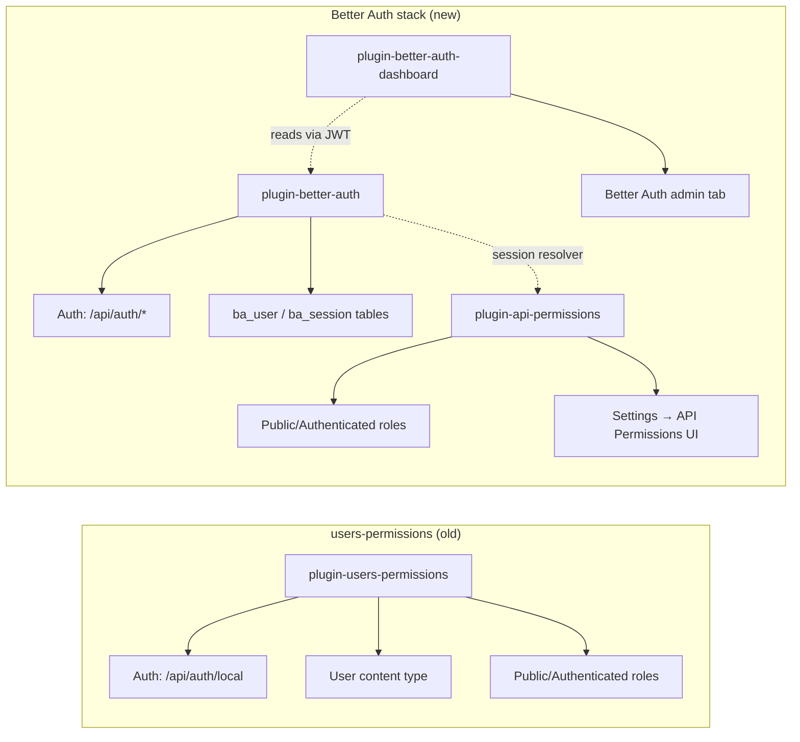

**TL;DR**

- Strapi's official `users-permissions` plugin works fine, but if you want modern auth flows (social providers, two-factor, magic links) the community Better Auth plugins are a solid alternative — though they're still in alpha/beta.
- The migration is more than a plugin swap: `plugin-better-auth` **refuses to load** alongside `users-permissions`, so you also lose the role/permission system U&P provides. You get it back by adding `plugin-api-permissions`.
- The full beta setup is actually **three** plugins: `plugin-better-auth` (auth flows), `plugin-api-permissions` (Content API RBAC), `plugin-better-auth-dashboard` (admin UI for users and sessions).
- You will hit installation gotchas the docs don't mention yet: a hard Strapi 5.45.0+ requirement, a zod major-version mismatch, an `@better-auth/core` hoisting issue, and a CLI resolution issue with `yarn dlx`. This post fixes all of them.
- Once everything is wired up, sign-up, sessions, and the admin dashboard all work end-to-end with the existing LaunchPad frontend with **one line changed**: the auth client's `baseURL`.

## Why This Post Exists

[Strapi LaunchPad](https://github.com/strapi/LaunchPad) is the marketing-site starter we use to show off what Strapi v5 + Next.js can do. Out of the box it uses the official `@strapi/plugin-users-permissions` plugin for auth, which is the safe, supported choice.

But Strapi's community has been building a more modern alternative: a set of plugins that wraps the excellent [Better Auth](https://better-auth.com) library and gives you sign-up flows, sessions, social providers, two-factor, magic links, and a real admin dashboard for managing users — all without writing controller code.

In this tutorial I'm going to walk you through, end to end, replacing `users-permissions` with the Better Auth stack on top of LaunchPad. You'll come out the other side with:

- A clean Strapi backend running `plugin-better-auth` + `plugin-api-permissions` + `plugin-better-auth-dashboard`
- The existing LaunchPad Next.js frontend hitting the new auth endpoints
- A working sign-up flow tested in the browser
- An admin dashboard at **Strapi Admin → Better Auth** for managing users and sessions

> **Heads-up before you start:** all three community plugins are pre-release at the time of writing (`plugin-better-auth` is in beta, the other two in alpha). Do **not** run this in production yet. This is a playground / starter-template exercise.

### Two ways to apply this

The rest of the post walks through every step by hand, so you understand what's actually being changed and why. That's the recommended path if you're encountering these plugins for the first time, or if your project differs from LaunchPad in any meaningful way.

If you'd rather just install it, there's a **Claude Code skill** that automates the entire process — it does all the file edits, dep installs, schema generation, and bootstrap seeding described below, scoped to **Strapi v5 + Next.js App Router**. Tell Claude Code something like *"set up better auth on this strapi and next.js project"* and the [`better-auth-setup`](https://github.com/PaulBratslavsky/launchpad-better-auth-example) skill will run. It uses the same templates and follows the same order as this post — reading the steps below first will still teach you what's happening, even if you use the skill to apply them.

## Architecture: How the Three Plugins Fit Together

`users-permissions` is one plugin that does three jobs at once: it authenticates users, it provides a User content type, and it authorizes API requests via roles and permissions. The Better Auth stack splits those concerns:



The trade-off: more plugins to install, but each has one job. You can swap `plugin-better-auth` out for any other auth provider later (Clerk, Auth0, Supabase) without rewriting your permission model, because `plugin-api-permissions` is auth-agnostic.

## Prerequisites

Before you start, make sure you have:

- **Node.js 20+**
- **Yarn** (LaunchPad uses Yarn 4)
- A code editor
- A clean working directory

## Step 1 — Clone LaunchPad and Get the Default Setup Running

Start from the official `main` branch so we share a baseline:

```bash
git clone https://github.com/strapi/LaunchPad.git
cd LaunchPad
```

LaunchPad is a monorepo-ish structure with two top-level folders:

```
LaunchPad/
├── strapi/        # Strapi v5 backend
├── next/          # Next.js 16 frontend
└── ...
```

Install dependencies for both:

```bash
cd strapi && yarn install
cd ../next && yarn install
```

Run the project once on `main` to confirm everything works on your machine:

```bash
# terminal 1
cd strapi && yarn develop

# terminal 2
cd next && yarn dev
```

Open `http://localhost:3000` — you should see the LaunchPad marketing site. Open `http://localhost:1337/admin`, create an admin user, and confirm `users-permissions` is in the plugins list. Then stop both servers and create a branch to do the migration on:

```bash
git checkout -b examples/better-auth
```

## Step 2 — Confirm Strapi is 5.45.0+

`plugin-better-auth` enforces a minimum Strapi version of `5.45.0` in its `register` lifecycle. Open `strapi/package.json` and check that `@strapi/strapi`, `@strapi/plugin-cloud`, and `@strapi/plugin-users-permissions` are all at `5.45.0` or higher.

At time of writing LaunchPad's `main` ships with `5.46.0`, so most likely you don't need to change anything. If you cloned an older snapshot, bump the three packages to a matching 5.45+ version:

```jsonc
{
  "dependencies": {
    "@strapi/plugin-cloud": "5.46.0",
    "@strapi/plugin-users-permissions": "5.46.0",
    "@strapi/strapi": "5.46.0"
  }
}
```

> **Why this is a hard requirement:** the plugin's `register.ts` calls `isVersionAtLeast(strapiVersion, MIN_STRAPI_VERSION)` and throws if you're below. There's no escape hatch.

## Step 3 — Remove `@strapi/plugin-users-permissions`

This one surprises people. `plugin-better-auth` doesn't coexist with users-permissions — it throws at boot time if it sees `users-permissions` installed. Disabling it in `config/plugins.ts` does not work; the check is for the package, not the enabled state.

The relevant lines from the plugin's [source](https://github.com/strapi-community/plugin-better-auth/blob/main/plugins/plugin-better-auth/server/src/register.ts):

```ts
const usersPermissionsPlugin = strapi.plugin("users-permissions");
if (usersPermissionsPlugin) {
  throw new Error(
    "[@strapi-community/plugin-better-auth] The 'users-permissions' plugin is installed. " +
      "Better Auth and users-permissions cannot be used together.",
  );
}
```

So remove it from `strapi/package.json`:

```diff
- "@strapi/plugin-users-permissions": "5.46.0",
```

This means you also lose the **Public** and **Authenticated** roles that users-permissions used to provide. Don't worry — we'll restore them via `plugin-api-permissions` in a moment, and your code won't notice because LaunchPad's existing code already routes auth through Better Auth (the previous branch state). If you're starting from a project that uses U&P for actual login or roles, plan a migration story for your existing users.

## Step 4 — Install the Three Community Plugins

From `strapi/`:

```bash
yarn add \
  better-auth \
  @strapi-community/plugin-better-auth \
  @strapi-community/plugin-api-permissions \
  @strapi-community/plugin-better-auth-dashboard \
  @better-auth/infra \
  @better-auth/core \
  zod@^4.1.12

yarn add -D @better-auth/cli
```

That looks like a lot of packages. Here's why each one is needed:

| Package | Why |
| --- | --- |
| `better-auth` | The core auth library. Already in LaunchPad. |
| `@strapi-community/plugin-better-auth` | The Strapi database adapter and route mounter. |
| `@strapi-community/plugin-api-permissions` | Restores Public/Authenticated roles + Content API RBAC. |
| `@strapi-community/plugin-better-auth-dashboard` | Admin panel UI for managing users and sessions. |
| `@better-auth/infra` | Peer dep of the dashboard's `dash()` plugin. |
| `@better-auth/core` | Yarn doesn't hoist it from `better-auth/node_modules/`. Adding it explicitly forces it to the top. |
| `zod@^4.1.12` | `@better-auth/infra` uses `z.email()`, which only exists in zod 4. Strapi pulls in zod 3 transitively. |
| `@better-auth/cli` (dev) | Used to regenerate the Better Auth schema. Local install avoids `yarn dlx` resolution issues. |

> **Heads-up if you skip the zod and `@better-auth/core` pins:** schema generation will fail with `TypeError: z.email is not a function` and `Cannot find package '@better-auth/core'` respectively. These two are the most-common dead ends — pin them at the top level and you'll never see those errors.

## Step 5 — Enable the Plugins in `config/plugins.ts`

Replace the existing better-auth block with the three-plugin config:

```ts
// strapi/config/plugins.ts
export default () => ({
  'better-auth': {
    enabled: true,
  },
  'better-auth-dashboard': {
    enabled: true,
  },
  'api-permissions': {
    enabled: true,
  },
});
```

That's all the configuration the plugins need here — the real Better Auth config has moved to its own file in `1.0.0-beta.1`.

## Step 6 — Create `src/lib/auth.ts`

This is the new home for the `betterAuth()` factory call. The schema generator reads this file, and the Strapi runtime imports it to handle requests.

```ts
// strapi/src/lib/auth.ts
import { betterAuth } from 'better-auth';
import { jwt } from 'better-auth/plugins';
import { strapiAdapter } from '@strapi-community/plugin-better-auth';
import { dash } from '@better-auth/infra';

export const auth = betterAuth({
  database: strapiAdapter(),
  secret: process.env.BETTER_AUTH_SECRET,
  baseURL: process.env.STRAPI_URL ?? 'http://localhost:1337',
  trustedOrigins: [process.env.CLIENT_URL ?? 'http://localhost:3000'],
  emailAndPassword: {
    enabled: true,
    requireEmailVerification: false,
  },
  session: {
    expiresIn: 60 * 60 * 24 * 7, // 7 days
  },
  advanced: {
    database: {
      generateId: 'serial',
    },
  },
  plugins: [
    jwt(),
    dash({
      apiUrl: process.env.STRAPI_URL ?? 'http://localhost:1337',
      apiKey:
        process.env.BETTER_AUTH_DASHBOARD_SECRET ??
        'strapi-internal-dashboard-key',
    }),
  ],
});
```

A few details worth flagging:

- **`generateId: 'serial'`** is required. It tells Better Auth to use auto-incrementing integer IDs so they line up with Strapi's primary keys. Forget this and you get foreign-key explosions on first sign-up.
- **`jwt()`** is a Better Auth plugin that adds a JWKS table — the dashboard signs internal requests with a JWT, so the JWKS table needs to exist for the dashboard to work.
- **`dash({...})`** wires the dashboard into Better Auth. The `apiKey` is the shared secret between the dashboard frontend and the Strapi instance — put the real value in `.env`.

## Step 7 — Add the Required Env Vars

LaunchPad ships an `.env.example` but no `.env` — if you skipped this earlier, copy it now:

```bash
cp strapi/.env.example strapi/.env
```

Then append the two Better Auth secrets:

```bash
BETTER_AUTH_SECRET=replace-with-a-long-random-string
BETTER_AUTH_DASHBOARD_SECRET=replace-with-another-long-random-string
```

Generate them with `openssl rand -base64 32` (or anything similar). For local dev you can keep the placeholder strings, but rotate them before any non-local deployment.

## Step 8 — Seed Public-Role Permissions on Bootstrap

`plugin-api-permissions` seeds the Public and Authenticated roles automatically on first boot — but **with zero permissions attached**. So even though your content API is now technically authorized, every anonymous `GET /api/article` returns 401.

You have two options: click each permission on in the admin UI under **Settings → API Permissions → Roles → Public**, or seed them in code. For a starter template with 12 content types, let's do it in code.

Open `strapi/src/index.ts` and replace the boilerplate with:

```ts
// strapi/src/index.ts
import type { Core } from '@strapi/strapi';

const ROLE_UID = 'plugin::api-permissions.role';
const PERMISSION_UID = 'plugin::api-permissions.permission';
const PUBLIC_READ_ACTIONS = ['find', 'findOne'] as const;

export default {
  register() {},

  async bootstrap({ strapi }: { strapi: Core.Strapi }) {
    if (!strapi.plugin('api-permissions')) return;
    // Defensive: skip if better-auth schema hasn't been generated yet.
    // Without this guard, schema generation in Step 9 fails because
    // api-permissions tries to count users on a content type that
    // doesn't exist yet.
    if (!strapi.contentTypes['plugin::better-auth.user' as never]) {
      strapi.log.warn(
        '[bootstrap] better-auth content types not found — run `yarn exec better-auth generate --config src/lib/auth.ts --yes` first.',
      );
      return;
    }

    const documents = strapi.documents as any;

    const publicRole = await documents(ROLE_UID).findFirst({
      filters: { type: 'public' },
    });

    if (!publicRole) {
      strapi.log.warn('[bootstrap] Public role not found — skipping permission seed.');
      return;
    }

    const apiContentTypeUids = Object.keys(strapi.contentTypes).filter((uid) =>
      uid.startsWith('api::'),
    );

    const existing: Array<{ action: string }> = await documents(PERMISSION_UID).findMany({
      filters: { role: { documentId: publicRole.documentId } },
      fields: ['action'],
    });
    const existingActions = new Set(existing.map((p) => p.action));

    for (const uid of apiContentTypeUids) {
      for (const action of PUBLIC_READ_ACTIONS) {
        const actionKey = `${uid}.${action}`;
        if (existingActions.has(actionKey)) continue;
        await documents(PERMISSION_UID).create({
          data: { action: actionKey, role: publicRole.id },
        });
      }
    }
  },
};
```

A few things to note about this:

- The bootstrap waits for `plugin-api-permissions` to be loaded, then checks that the Better Auth content types exist before doing anything. **This guard is essential** — the schema-generation step in Step 9 boots Strapi with the new plugins, and `plugin-api-permissions` will crash if the bootstrap tries to query roles before the Better Auth `user` content type exists. The guard lets the first run be a no-op.
- It iterates every `api::*.*` content type in your project and grants the Public role `find` and `findOne` on each.
- The action format is `<content-type-uid>.<action>` — e.g. `api::article.article.find`. That's the format the underlying CASL ability engine expects.
- The check `if (existingActions.has(actionKey)) continue;` makes the bootstrap idempotent. Restarting Strapi won't duplicate permissions.
- We cast `strapi.documents` to `any` because Strapi's generated TypeScript types don't include the `api-permissions` plugin's content types. Without the cast, `yarn seed` (which type-checks first) fails with `Argument of type '"plugin::api-permissions.permission"' is not assignable to parameter of type 'ContentType'`.

## Step 9 — Generate the Better Auth Schema

`plugin-better-auth` in beta ships with **zero content types**. You generate them from `src/lib/auth.ts` using the Better Auth CLI:

```bash
yarn exec better-auth generate --config src/lib/auth.ts --yes
```

> **Why `yarn exec` instead of `yarn dlx`?** The Better Auth docs say to run `npx auth generate`. With Yarn 4 + node-modules linker, `yarn dlx` runs the CLI in an isolated cache directory that can't see your project's hoisted `@better-auth/core` — it errors out with `Cannot find package '@better-auth/core'`. Installing `@better-auth/cli` as a local dev dep (Step 4) and calling it with `yarn exec better-auth ...` resolves correctly against your project's node_modules.

You should see output like:

```
preparing schema...
Your schema is now up to date.
```

And new files in `strapi/src/extensions/better-auth/content-types/`:

```
src/extensions/better-auth/content-types/
├── account/schema.json
├── jwks/schema.json        ← added by jwt()
├── session/schema.json
├── user/schema.json
└── verification/schema.json
```

The Better Auth tables are prefixed with `ba_` by default (`ba_user`, `ba_session`, `ba_account`, `ba_verification`, `ba_jwks`). Re-run the generator every time you add or remove a Better Auth plugin in `src/lib/auth.ts`.

## Step 10 — Wire Up the Next.js Frontend

LaunchPad's `main` ships with a sign-up *page* but the form is a static UI mockup — there's no auth client, no submit handler, no sign-in page, and no user menu in the navbar. We need to add all of that. There are five edits here.

First, copy `.env.example` to `.env` in the frontend so the Strapi client knows where to call:

```bash
cp next/.env.example next/.env
```

The important key is `NEXT_PUBLIC_API_URL=http://localhost:1337`. If it's missing, the Next.js Strapi client errors out before any page can render with `Could not initialize the Strapi Client … Could not parse invalid URL: "/api"`.

Install the Better Auth client SDK:

```bash
cd next && yarn add better-auth
```

### 10.1 Create the auth client

```ts
// next/lib/auth-client.ts
import { createAuthClient } from 'better-auth/react';

import { API_URL } from './utils';

export const authClient = createAuthClient({
  baseURL: `${API_URL}/api/auth`,
});

export const { signIn, signUp, signOut, useSession } = authClient;
```

Note the endpoint path is `/api/auth`, not `/api/better-auth` — the path was renamed in `1.0.0-beta.1`.

### 10.2 Update `register.tsx` with a submit handler

LaunchPad's existing `register.tsx` has a form but no handler. Replace it with a version that wires the form to `signUp.email`:

```tsx
// next/components/register.tsx
'use client';

import {
  IconBrandGithubFilled,
  IconBrandGoogleFilled,
} from '@tabler/icons-react';
import { Link } from 'next-view-transitions';
import { useParams, useRouter } from 'next/navigation';
import React, { useState } from 'react';

import { Container } from './container';
import { Button } from './elements/button';
import { Logo } from './logo';
import { signIn, signUp } from '@/lib/auth-client';

export const Register = () => {
  const router = useRouter();
  const params = useParams<{ locale: string }>();
  const locale = params?.locale ?? 'en';
  const [name, setName] = useState('');
  const [email, setEmail] = useState('');
  const [password, setPassword] = useState('');
  const [error, setError] = useState<string | null>(null);
  const [isSubmitting, setIsSubmitting] = useState(false);

  async function handleSubmit(e: React.FormEvent<HTMLFormElement>) {
    e.preventDefault();
    setError(null);
    setIsSubmitting(true);
    const { error: signUpError } = await signUp.email({
      email,
      password,
      name: name || email,
    });
    setIsSubmitting(false);
    if (signUpError) {
      setError(signUpError.message ?? 'Sign up failed');
      return;
    }
    router.push(`/${locale}`);
    router.refresh();
  }

  async function handleSocial(provider: 'github' | 'google') {
    setError(null);
    const { error: socialError } = await signIn.social({
      provider,
      callbackURL: `/${locale}`,
    });
    if (socialError) setError(socialError.message ?? `${provider} sign-in failed`);
  }

  // (rest of the JSX is the form layout LaunchPad already ships — bind name/email/password to state, render `error` if set, disable submit when isSubmitting; the [`launchpad-better-auth-example`](https://github.com/PaulBratslavsky/launchpad-better-auth-example) repo has the full file)

  return (/* form JSX from the example repo */);
};
```

### 10.3 Add a sign-in page

LaunchPad doesn't have one. Create the route:

```tsx
// next/app/[locale]/sign-in/page.tsx
import { AmbientColor } from '@/components/decorations/ambient-color';
import { SignInForm } from '@/components/sign-in-form';

export default function SignInPage() {
  return (
    <div className="relative overflow-hidden">
      <AmbientColor />
      <SignInForm />
    </div>
  );
}
```

And the form component — same shape as `Register`, but calling `signIn.email({ email, password })` and `signIn.social({ provider, callbackURL })`. Full file in the [example repo](https://github.com/PaulBratslavsky/launchpad-better-auth-example/blob/main/next/components/sign-in-form.tsx).

### 10.4 Add a user menu to the navbar

```tsx
// next/components/navbar/user-menu.tsx
'use client';

import { useRouter } from 'next/navigation';
import { useState } from 'react';

import { Button } from '@/components/elements/button';
import { signOut, useSession } from '@/lib/auth-client';

export const UserMenu = ({ locale }: { locale: string }) => {
  const router = useRouter();
  const { data: session, isPending } = useSession();
  const [isSigningOut, setIsSigningOut] = useState(false);

  if (isPending) return null;
  if (!session?.user) return null;

  const displayName = session.user.name || session.user.email;

  async function handleSignOut() {
    setIsSigningOut(true);
    await signOut();
    setIsSigningOut(false);
    router.push(`/${locale}`);
    router.refresh();
  }

  return (
    <div className="flex items-center gap-2">
      <span className="text-white text-sm whitespace-nowrap">Hi {displayName}</span>
      <Button variant="simple" onClick={handleSignOut} disabled={isSigningOut}>
        {isSigningOut ? 'Logging out…' : 'Logout'}
      </Button>
    </div>
  );
};
```

### 10.5 Mount `UserMenu` in the desktop and mobile navbars

Edit `next/components/navbar/desktop-navbar.tsx` and `next/components/navbar/mobile-navbar.tsx` to render `<UserMenu locale={locale} />` in the right slot of the navbar. The example repo has both files committed — diff against `main` to see exactly where the component slots in.

> **Shortcut:** since the frontend changes are scoped to those five files, the fastest way to apply this step is to copy them from the [`launchpad-better-auth-example`](https://github.com/PaulBratslavsky/launchpad-better-auth-example) repo into your `next/` folder. The Strapi-side configuration is what makes this tutorial different from a generic Better Auth setup — the frontend is just a stock Better Auth React client wiring.

## Step 11 — Reset and Reseed the Database

Because we changed the schema (new `ba_*` tables, new `api_permissions_*` tables), wipe the local dev DB and reimport the seed data:

```bash
rm -f strapi/.tmp/data.db
cd strapi && yes | yarn seed
```

(If you're using PostgreSQL or another database, drop and recreate the database instead of deleting `.tmp/data.db`.)

## Step 12 — Boot It Up

```bash
# terminal 1
cd strapi && yarn develop

# terminal 2
cd next && yarn dev
```

You should see Strapi start cleanly with no plugin errors. Open:

- **http://localhost:1337/admin** — log in, you'll see a new **Better Auth** tab in the left nav (the dashboard). Under **Settings → API Permissions** you'll see the role manager with Public and Authenticated pre-seeded.
- **http://localhost:3000** — the LaunchPad marketing site.

## Step 13 — Test the Sign-Up Flow

Navigate to `http://localhost:3000/en/sign-up`, fill in name / email / password, and submit. You should see:

1. A `POST` to `http://localhost:1337/api/auth/sign-up/email` returning `200` with `{token, user: {id, name, email, ...}}`
2. A session cookie set on `localhost:1337`
3. A redirect to `/`
4. The navbar updates to "Hi {name}" with a Logout button

If you want to verify from the command line:

```bash
curl -X POST http://localhost:1337/api/auth/sign-up/email \
  -H 'content-type: application/json' \
  -d '{"email":"test@example.com","password":"testpass1234","name":"Test"}'
```

You should get a 200 with a token and user object.

Then jump to the Strapi admin's **Better Auth** tab — your new user appears in the user list, with metrics, growth chart, and the ability to revoke sessions or ban accounts.

## What You Get for the Effort

After all that, here's what's different from `users-permissions`:

| Concern | users-permissions | Better Auth stack |
| --- | --- | --- |
| Sign-up endpoint | `/api/auth/local/register` | `/api/auth/sign-up/email` |
| Sign-in endpoint | `/api/auth/local` | `/api/auth/sign-in/email` |
| User content type | `plugin::users-permissions.user` | `plugin::better-auth.user` (table `ba_user`) |
| Role/permission UI | Settings → Users & Permissions → Roles | Settings → API Permissions → Roles |
| Admin user management | Content Manager → User | Better Auth dashboard tab (search, metrics, sessions, ban) |
| Social providers | requires custom controller code | one line per provider in `auth.ts` |
| Two-factor auth | not supported out of the box | one line: add `twoFactor()` plugin |
| Magic links | requires custom code | one line: add `magicLink()` plugin |
| Frontend SDK | none — fetch by hand | `better-auth/react`: `useSession`, `signIn`, `signUp`, `signOut` |

The dashboard alone is a big quality-of-life upgrade — DAU / WAU / MAU, growth chart, cohort retention, per-user session list with revoke buttons.

## Common Errors and Their Fixes

If something goes wrong, here are the failure modes I hit while writing this:

**`Error: The 'users-permissions' plugin is installed.`**
You missed Step 3. Remove `@strapi/plugin-users-permissions` from `package.json` and reinstall. Disabling in `config/plugins.ts` does not work.

**`Strapi v5.4x.x is not supported. Please upgrade to v5.45.0 or higher.`**
Bump `@strapi/strapi`, `@strapi/plugin-cloud`, and any other `@strapi/*` packages to 5.45.0 or higher (Step 2). The current `main` of LaunchPad already meets this; this only bites if you clone an older snapshot.

**`Could not initialize the Strapi Client … Could not parse invalid URL: "/api"`** (from the Next.js dev server, on every page)
You forgot to create `next/.env`. Copy `next/.env.example` to `next/.env` so `NEXT_PUBLIC_API_URL` is set (Step 10).

**Schema generation crashes with `TypeError: Cannot read properties of undefined (reading 'attributes')` and a stack trace pointing into `addUserCount`**
Your `src/index.ts` bootstrap is calling `findMany` on `plugin::api-permissions.role` during schema generation, before the Better Auth `user` content type exists. Add the defensive guard from Step 8 that returns early when `strapi.contentTypes['plugin::better-auth.user']` is missing.

**`TypeError: z.email is not a function`** during `better-auth generate`
The hoisted zod is 3.x. Add `zod@^4.1.12` as a top-level dep in `strapi/package.json` and reinstall.

**`Cannot find package '@better-auth/core'`** during `better-auth generate`
Two fixes, combined:
1. Add `@better-auth/core` as a direct dep so it hoists to the top of node_modules
2. Use `yarn exec better-auth ...` with the locally-installed CLI instead of `yarn dlx`

**`401 Unauthorized` on every `/api/*` content endpoint** after upgrade
The Public role has zero permissions. Either run the bootstrap from Step 8 or toggle the permissions manually in **Settings → API Permissions → Roles → Public**.

**`router.push('/')` after sign-up returns 404 in a localized app**
LaunchPad uses an i18n middleware that requires a locale prefix. Push to `` `/${locale}` `` from your sign-up / sign-in form instead of plain `/`.

## Branch Strategy: Keep It as an Example, Don't Merge

One last thing. This isn't a migration you'll want to merge back into LaunchPad's `main`. The Strapi team can't ship a starter that drops `users-permissions` — too much of the ecosystem still depends on it. So the pragmatic move is to keep this branch as a **long-lived example branch**, not a PR:

```bash
git branch -m feat/implement-better-auth examples/better-auth
git push --set-upstream origin examples/better-auth
```

Add a section to your `README.md` on main pointing at the branch so people can find it, and periodically merge `main` into `examples/better-auth` to keep dependencies fresh. Do **not** merge it the other way.

## Where to Go Next

- The full reproducible setup with every file change lives on the [`examples/better-auth`](https://github.com/strapi/LaunchPad) branch of LaunchPad
- The companion `BETTER-AUTH-SETUP.md` in that branch is a concise reference if you don't want the narrative version
- For social providers, plug them into `src/lib/auth.ts` — see the [Better Auth providers docs](https://better-auth.com/docs/authentication/email-password)
- For 2FA, magic links, or organizations, add the corresponding Better Auth plugins to `src/lib/auth.ts` and re-run `yarn exec better-auth generate`
- File issues against the community plugins on [github.com/strapi-community/plugin-better-auth](https://github.com/strapi-community/plugin-better-auth) — they're actively maintained and the maintainers respond fast

This is what a modern, modular Strapi auth setup looks like. It's not yet production-ready, but it's a solid playground for evaluating whether you want to move off `users-permissions` longer term.

**Citations**

- Strapi LaunchPad: https://github.com/strapi/LaunchPad
- strapi-community/plugin-better-auth monorepo: https://github.com/strapi-community/plugin-better-auth
- plugin-better-auth source (register guard): https://github.com/strapi-community/plugin-better-auth/blob/main/plugins/plugin-better-auth/server/src/register.ts
- plugin-api-permissions README: https://github.com/strapi-community/plugin-better-auth/blob/main/plugins/plugin-api-permissions/README.md
- plugin-better-auth-dashboard README: https://github.com/strapi-community/plugin-better-auth/blob/main/plugins/plugin-better-auth-dashboard/README.md
- Better Auth docs site: https://strapi-community.github.io/plugin-better-auth/docs/intro
- Better Auth installation page: https://strapi-community.github.io/plugin-better-auth/docs/better-auth/installation
- Better Auth schema page: https://strapi-community.github.io/plugin-better-auth/docs/better-auth/schema
- Better Auth client setup page: https://strapi-community.github.io/plugin-better-auth/docs/better-auth/client-setup
- Better Auth upstream library: https://better-auth.com
- Better Auth database concepts: https://better-auth.com/docs/concepts/database
- Better Auth JWT plugin: https://better-auth.com/docs/plugins/jwt
- 1.0.0-beta.1 release notes: https://github.com/strapi-community/plugin-better-auth/releases/tag/1.0.0-beta.1
- Strapi v5 documentation: https://docs.strapi.io
